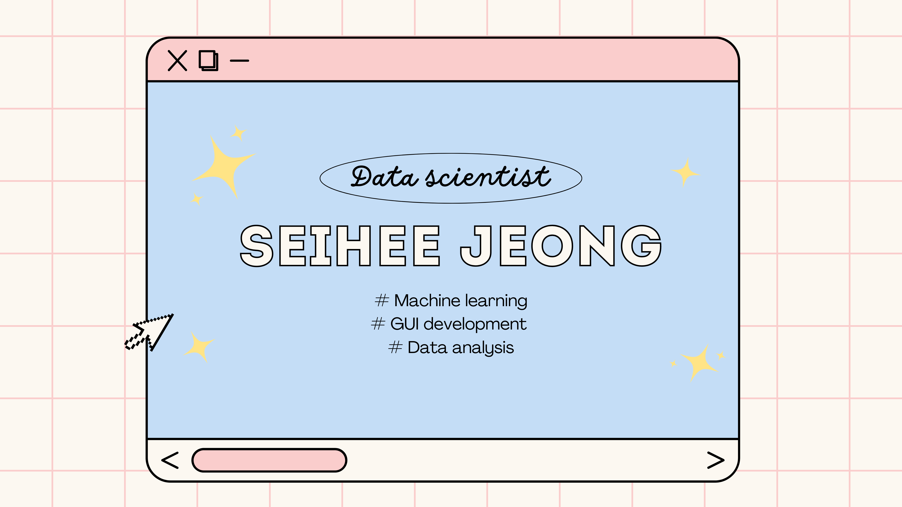

<!--
**jseihee/jseihee** is a ✨ _special_ ✨ repository because its `README.md` (this file) appears on your GitHub profile.

Here are some ideas to get you started:

- 🔭 I’m currently working on ...
- 🌱 I’m currently learning ...
- 👯 I’m looking to collaborate on ...
- 🤔 I’m looking for help with ...
- 💬 Ask me about ...
- 📫 How to reach me: ...
- 😄 Pronouns: ...
- ⚡ Fun fact: ...
-->

<!-- Main Banner -->

<!-- Introduction -->
## 🌼 About me 
Hi, I'm Seihee 👋 I'm a data science student with a passion for machine learning + data analysis + UX design.  
I love working with data - cleaning, exploring, analysing - to create stories with data to deliver data-driven insights to both technical & non-technical audiences!  
Aligning with my design skills, I'm also interested in GUI development, with a particular focus on designing an accessible GUI to reach a diverse user audience.
 

### 👩‍💻 I'm currently working on..
* Developing a machine learning modeling with NRL(nucleosome repeat length) data for chronological age & breast cancer classification
* Improving & adding features to my Grade analysis ToolBox project GUI
* Beginning to contribute on open-source projects on GitHub
* My blog

### 📝 I'm currently learning..
* Deep learning (Keras - TensorFlow)
* JavaScript
  

<!-- Badges -->
## 💻 Technical skills

  

<!-- GitHub Stats -->
## 📊 GitHub Stats

  

<!-- Media links -->
## 🤝 Connect with me!

